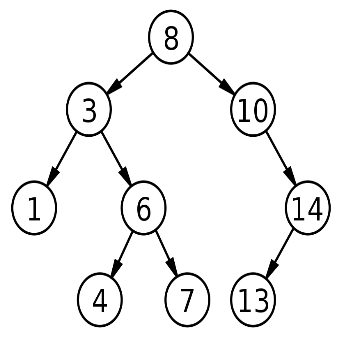

## Chapter 1

| English | [Spanish](https://github.com/orlandc/eopl-flp-univalle/blob/master/chapter%201%20-%20Recursion/LEEME.md) |
| :---    |                                                                                                   -----: |

### Recursion

**1.** Create a function called copy that receives two arguments: a number n and an entry x. The function must return a list with n occurrences of x.

Examples:

| Commands              | outputs                                     |
| :---                  | :---                                        |
| (copy 7 ’seven)       | (seven seven seven seven seven seven seven) |
| (copy 4 (list 1 2 3)) | ((1 2 3) (1 2 3) (1 2 3) (1 2 3))           |
| (copy 0 (list 5 6 7)) | ()                                          |

**2.** Create a function called list-tails that receives as argument a list L, the function returns in a list of all the sublists of the consecutive elements of the list L.

Examples:

| Commands                      | outputs                                               |
| :---                          | :---                                                  |
| (list-tails ’(1 2 3 4 5))     | ((1 2 3 4 5) (2 3 4 5) (3 4 5) (4 5) (5))             |
| (list-tails ’(1 a (e 4) 5 v)) | ((1 a (e 4) 5 v) (a (e 4) 5 v) ((e 4) 5 v) (5 v) (v)) |

**3.** Create a function called list-set that receives three arguments: a list L, a number n and an element x. The function must return a list similar to the one it receives (L), but it must have in the entered position n (indexing from zero) the element x.

Examples:

| Commands                          | outputs          |
| :---                              | :---             |
| (list-set ’(a b c d) 2 ’(1 2))    | (a b (1 2) d)    |
| (list-set ’(a b c d) 3 ’(1 5 10)) | (a b c (1 5 10)) |

**4.** Create a function called exists? that must receive two arguments: a predicate P and a list L. The function returns #t if any element of the list L satisfies the predicate P. It returns #f otherwise.

Examples:

| Commands                       | outputs |
| :---                           | :---    |
| (exists? number? ’(a b c 3 e)) | #t      |
| (exists? number? ’(a b c d e)) | #f      |

**5.** Create a function called list-index that must receive two arguments: a predicate P and a list L. The function returns (from initial position 0) the first element of the list that satisfies the predicate L. If there is no element that satisfies the predicate received, the function must return #f.

Examples:

| Commands                               | outputs |
| :---                                   | :---    |
| (list-index number? ’(a 2 (1 3) b 7))  | 1       |
| (list-index symbol? ’(a (b c) 17 foo)) | 0       |
| (list-index symbol? ’(1 2 (a b) 3))    | #f      |

**6.** Create a function called list-facts that receives as an argument an integer n, and returns an incremental list of factors, starting from 1! until n !.

Examples:

| Commands       | outputs                       |
| :---           | :---                          |
| (list-facts 5) | (1 2 6 24 120)                |
| (list-facts 8) | (1 2 6 24 120 720 5040 40320) |

**7.** Create a function called cartesian-product that receives as arguments 2 lists of symbols without repetitions L1 and L2. The function must return a list of tuples that represent the Cartesian product between L1 and L2. The pairs can appear in any order.

Examples:

| Commands                              | outputs                                                 |
| :---                                  | :---                                                    |
| (cartesian-product ’(a b c) ’(x y))   | ((a x) (a y) (b x) (b y) (c x) (c y))                   |
| (cartesian-product ’(p q r) ’(5 6 7)) | ((p 5) (p 6) (p 7) (q 5) (q 6) (q 7) (r 5) (r 6) (r 7)) |

**8.** Create a function called mapping that should receive as input 3 arguments: a unary function (which receives an argument) called F, and two lists of numbers L1 and L2. The function must return a list of pairs (a, b) being an element of L1 and b element of L2, fulfilling the property that when applying the unary function F with the argument a, it must throw the number b. That is, it must be fulfilled that F(a) = b. (The lists must be of equal size).

Examples:

| Commands                                                  | outputs             |
| :---                                                      | :---                |
| (mapping (lambda (d) (* d 2)) (list 1 2 3) (list 2 4 6))  | ((1 2) (2 4) (3 6)) |
| (mapping (lambda (d) (* d 3)) (list 1 2 2) (list 2 4 6))  | ((2 6))             |
| (mapping (lambda (d) (* d 2)) (list 1 2 3) (list 3 9 12)) | ()                  |

**9.** Create a function called inversions that receives as input a list L, and determines the number of elements inverted from the list L. Formally, let A = (a~1~ a~2~ ... a~n~) a list of n different numbers, if i<j (position) y a~i~ > a~j~ (data in the position) then the pair (i j) is an inversion of A.

Examples:

| Commands                  | outputs |
| :---                      | :---    |
| (inversions ’(2 3 8 6 1)) | 5       |
| (inversions ’(1 2 3 4))   | 0       |
| (inversions ’(3 2 1))     | 3       |

**10.** Create a function called "up" that receives as input a list L, the function removes a pair of parentheses to each element of the highest level of the list. If an element of this level is not a list (it does not have parentheses), this element is included in the resulting output without any modification.

Examples:

| Commands            | outputs   |
| :---                | :---      |
| (up ’((1 2) (3 4))) | (1 2 3 4) |
| (up ’((x (y)) z))   | (x (y) z) |

**11.** Create a function called merge that receives as input two lists of integers ordered upwards L1 and L2. the merge function returns an ordered list of all the elements of the lists L1 and L2.

Examples:

| Commands                                | outputs                     |
| :---                                    | :---                        |
| (merge ’(1 4) ’(1 2 8))                 | (1 1 2 4 8)                 |
| (merge ’(35 62 81 90 91) ’(3 83 85 90)) | (3 35 62 81 83 85 90 90 91) |

**12.** Create a function called zip that receives three parameters as input: a binary function (function that expects to receive two arguments) F, and two lists L1 and L2, both of equal size. The zip procedure must return a list where the n-th position corresponds to the result of applying the function F on the elements in the nth position in L1 and L2.

Examples:

| Commands                    | outputs     |
| :---                        | :---        |
| (zip + ’(1 4) ’(6 2))       | (7 6)       |
| (zip * ’(11 5 6) ’(10 9 8)) | (110 45 48) |

**13.** Create a function called filter-acum that receives 5 parameters as input: two numbers a and b, a binary function F, an initial value accum and a unary function filter. The filter-acum procedure will apply the binary function F to all elements in the interval [a, b] and all these elements comply with filter function predicate's, the result should be kept in accum and the final value of accum must be returned.

Examples:

| Commands                     | outputs |
| :---                         | :---    |
| (filter-acum 1 10 + 0 odd?)  | 25      |
| (filter-acum 1 10 + 0 even?) | 30      |

**14.** Create a function called sort that receives two arguments as input: a list of L elements and a comparison function F. The function must return the ordered L list by applying the comparison function F.

Examples:

| Commands                                  | outputs                  |
| :---                                      | :---                     |
| (sort ’(8 2 5 2 3) <)                     | (2 2 3 5 8)              |
| (sort ’(8 2 5 2 3) >)                     | (8 5 3 3 2)              |
| (sort ’("a" "c" "bo" "za" "lu") string>?) | ("za" "lu" "c" "bo" "a") |

**15.** Create a function called path that receives as input two parameters: a number n and a binary search tree (representing with lists) BST (the tree must contain the integer n). The function must return a list with the route to be taken (starting from the root node of the tree), indicated by left and right chains, until arriving at the number n received. If the number n is found in the root node, the procedure must return an empty list.

Examples:

| Commands                                  | outputs                  |
| :---                                      | :---                     |
| (path 17 ’(14 (7 () (12 () ())) &nbsp;&nbsp;&nbsp;&nbsp;&nbsp;&nbsp;&nbsp;&nbsp;&nbsp;&nbsp;&nbsp;&nbsp;&nbsp;&nbsp;&nbsp;&nbsp;&nbsp;&nbsp;&nbsp;&nbsp;&nbsp;(26 (20 (17 () ()) &nbsp;&nbsp;&nbsp;&nbsp;&nbsp;&nbsp;&nbsp;&nbsp;&nbsp;&nbsp;&nbsp;&nbsp;&nbsp;&nbsp;&nbsp;&nbsp;&nbsp;&nbsp;&nbsp;&nbsp;&nbsp;&nbsp;&nbsp;&nbsp;&nbsp;&nbsp;&nbsp;&nbsp;&nbsp;&nbsp;&nbsp;&nbsp;&nbsp;()) &nbsp;&nbsp;&nbsp;&nbsp;&nbsp;&nbsp;&nbsp;&nbsp;&nbsp;&nbsp;&nbsp;&nbsp;&nbsp;&nbsp;&nbsp;&nbsp;&nbsp;&nbsp;&nbsp;&nbsp;&nbsp;&nbsp;&nbsp;&nbsp;&nbsp;&nbsp;&nbsp;(31 () ()))))   | (right left left)        |

**Disclaimer:** For exercise number 15, the representation of Binary Search Tree, racket lists must be used, and could be represented with the help of the following BNF grammar:

| <árbol-binario> | := (árbol-vacı́o) empty                           |
| :---            | :---                                             |
|                 | := (nodo) número <árbol-binario> <árbol-binario> |

    

The Binary Search Tree, represented in Racket with lists and using the previous grammar, would be:

**’(8 (3 (1 () ()) (6 (4 () ()) (7 () ()))) (10 () (14 (13 () ()) ())))**

